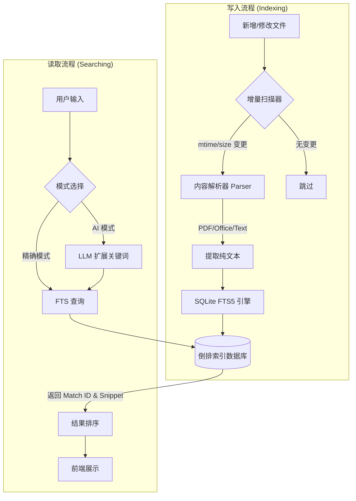

# 文件搜索神器核心架构与优化评估报告

## 1. 核心架构：预先索引 + 倒排数据库

本系统采用了业界标准的高性能全文检索架构，其核心流程分为**索引构建**（写路径）与**搜索执行**（读路径）两个阶段。

### 1.1 核心工作流程图

### 1.2 关键技术栈

| 组件 | 技术实现 | 作用 |
| :--- | :--- | :--- |
| **存储引擎** | **SQLite** | 轻量级、无服务器、本地文件存储，极其适合桌面应用。 |
| **索引技术** | **FTS5 (Full-Text Search)** | SQLite 的官方扩展，提供高性能的倒排索引功能。 |
| **分词器** | **Trigram Tokenizer** | 将文本切分为三元组（如 "搜索系统" -> "搜索"、"索系"、"系统"），极大提升了模糊匹配（如 `LIKE %keyword%`）的性能，同时避免了中文分词的复杂性。 |
| **解析层** | `pypdf`, `python-docx` 等 | 针对不同文件格式的专用解析器，确保高保真提取文本。 |
| **并发控制** | **WAL (Write-Ahead Logging)** | 开启 WAL 模式，允许**读写并发**，即在建立索引的同时也能进行搜索，不会卡顿。 |

---

## 2. 架构优势

1.  **极速响应**: 搜索时直接查询索引，时间复杂度接近 O(1)，而非遍历文件的 O(N)。即使有数万文件，搜索也能在毫秒级完成。
2.  **增量更新**: 智能识别文件变更，只处理修改过的文件，极大降低了 CPU 和 I/O 消耗。
3.  **零依赖**: 基于 SQLite，无需用户安装 Elasticsearch 或 MySQL 等大型数据库服务，解压即用。
4.  **隐私安全**: 所有索引和数据完全存储在用户本地硬盘，无数据上传风险。

---

## 3. 改进空间与优化建议 (评估)

尽管当前架构已经非常高效，但随着文件量的增长（如达到 10万+ 或 TB 级别）或用户需求的提升，仍有以下优化空间：

### 3.1 性能与规模优化
*   **⚠️ 异步索引队列**: 目前索引可能是同步或简单的线程操作。建议引入**任务队列 (Task Queue)**，将大文件的索引任务放入后台低优先级队列，避免阻塞主线程或占用过多 CPU 导致界面卡顿。
*   **分片索引 (Sharding)**: 如果索引文件 (`.db`) 超过 2GB，查询性能可能会下降。可以考虑按时间或文件夹对数据库进行分表或分库（如 `index_2023.db`, `index_2024.db`）。
*   **OCR 集成**: 目前仅支持文本提取。对于**扫描版 PDF**或**图片**，内容无法被索引。集成轻量级 OCR (如 PaddleOCR 或 Tesseract) 可以填补这一空白。

### 3.2 搜索体验优化
*   **语义向量搜索 (RAG 雏形)**:
    *   **现状**: 目前是基于关键词匹配（Lexical Search）。即使用户搜 "合同"，如果文中只有 "协议"，可能搜不到（虽然 AI 扩展缓解了这个问题）。
    *   **改进**: 引入 **嵌入向量 (Embeddings)**。将文本段落转化为向量存入向量数据库（如 ChromaDB 或 SQLite-vss）。
    *   **效果**: 实现真正的语义搜索。搜 "怎么请假"，能搜到包含 "年假申请流程" 的文档，即使没有 "请假" 二字。
*   **混合搜索 (Hybrid Search)**: 结合 `FTS 关键词搜索` (精准) + `Vector 向量搜索` (语义)，再通过 `RRF (Reciprocal Rank Fusion)` 算法重新排序，提供最完美的搜索结果。

### 3.3 预览与交互
*   **命中位置高亮增强**: 目前返回的 snippet 可能不够精确。可以改进算法，返回包含关键词的**完整句子**或**段落**，而不仅仅是前后 N 个字符。
*   **快速预览**: 实现“按空格预览”功能，无需打开文件即可在应用内查看文件内容，并自动滚动到关键词位置。

### 3.4 格式支持扩展
*   **压缩包支持**: 支持索引 `.zip`, `.rar` 内部的文件。
*   **邮件支持**: 支持解析 `.eml`, `.msg` 文件（Outlook 邮件）。

---

## 4. 总结
当前的 "FTS5 + Trigram" 架构对于个人桌面级搜索（10万文件以内）是**性价比最高**的选择，它平衡了性能、资源占用和开发复杂度。
如果后续要进阶为“企业级知识库”，则 **OCR** 和 **向量语义搜索** 将是两个最大的增值方向。
